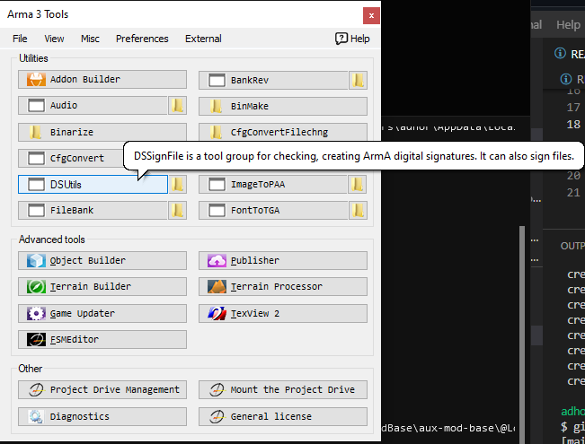
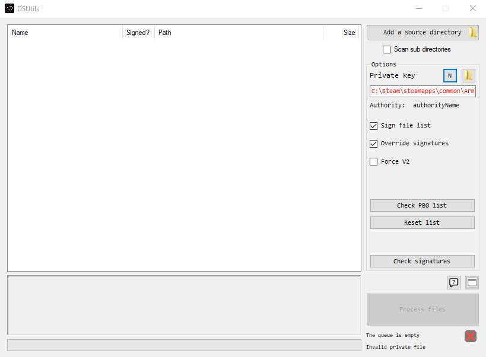
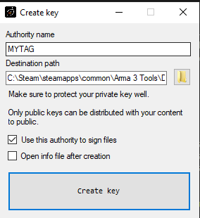
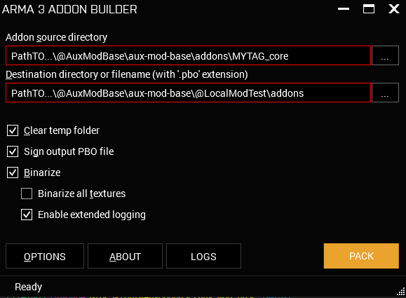
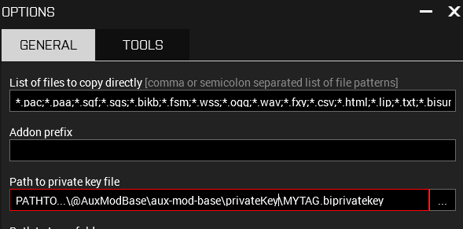

# aux-mod-base
Auxiliary mod base example; primarily for mods developed off of Legion Studios content, but applicable to any context or mod

This is not concerned with higher and/or more complex development practices, such as the use of a P:\ drive and development of custom assets. This is set up with the idea that someone with the absolute bare minimum amount of skill could make their own asset retexture mod out of this example.

As we develop more content and/or classnames change, this repository will be updated.

# Important Notes
You may branch, fork, copy, modify, etc. this code.

It's meant to be used so that your life can be easier.

## MYTAG -
This is a 3-5 character unique string which **DOES NOT START WITH A NUMBER**, you will prefix all classnames, pbos, and everything you do with this tag.

If you start your tag with a number, under certain conditions, classnames called via scripted calls and configs will error out without any warnings or logs (typically found when making custom ACE actions, functions, and other complex, intricate methods)

## Keys
How do I create a key?

Open up DSUtils in the Arma 3 Tools

Click the 'N' button

Create your new key

It will create two files `MYTAG.bikey` and `MYTAG.biprivatekey`.

`MYTAG.bikey` is what you should put in the `@LocalModTest\key` folder

`MYTAG.biprivatekey` should go in the `privateKey` folder.

Your private key is essentially your fingerprint on the workshop. Do not share it lightly!

## Build Methods
These mods are set up with the understanding that you will be using the default arma 3 tool, "AddonBuilder". If you plan on using Mikero's tools, you will need to change these pathings.

When using addon builder for the first time you will want to go to "Options"

...and copy and paste this: `*.pac;*.paa;*.sqf;*.sqs;*.bikb;*.fsm;*.wss;*.ogg;*.wav;*.fxy;*.csv;*.html;*.lip;*.txt;*.bisurf;*.sqm;*.ext;*.dbf;*.prj;*.shx;*.shp;*.jpg;*.rvmat;*.inc;*.xml;` to the 'List of files to copy directly' input.

You will also want to put your direct path to the privateKey for Addon Builder to sign it.

## Testing and Publishing
You can use @LocalModTest both as a local test mod and as a publishing folder via the Arma 3 Publisher
